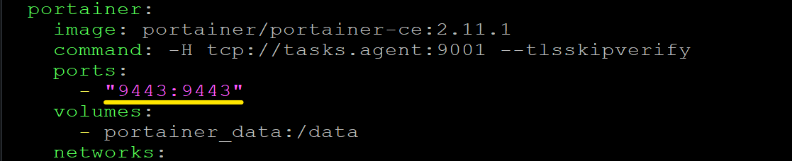

# Portainer, установка и первый запуск

Веб доступ к Docker. Пример для режима swarm.

Оригинал статьи, установка - [Install Portainer with Docker Swarm on Linux - Portainer Documentation.](https://docs.portainer.io/start/install/server/swarm/linux)

Оригинал статьи, первый запуск - [Initial setup - Portainer Documentation.](https://docs.portainer.io/start/install/server/setup)

Перед выполнением команд следует проверить их на соответствие командам из оригинальной статьи.

Для файлов рекомендуется создать отдельную папку, например `/var/devops`

Скачиваем YML манифест.
```
curl -L https://downloads.portainer.io/portainer-agent-stack.yml -o portainer-agent-stack.yml
```

Ошибка `curl: (60) SSL certificate problem: unable to get local issuer certificate` может появляться при работы из закрытой сети. Следуюет добавить ключ -k, для разрешения создания незащищенного подключения:

```
curl -L -k https://downloads.portainer.io/portainer-agent-stack.yml -o portainer-agent-stack.yml
```

Portainer использует порт `9000`, как и Sonar. Необходимо изменить содержимое файла, оставив только порт `9443`.


Устанавливаем.
```
docker stack deploy -c portainer-agent-stack.yml portainer
```

Проверяем.
```
docker ps
```

Результат выполнения:

```
CONTAINER ID   IMAGE                           COMMAND                  CREATED              STATUS          PORTS                          NAMES
fb7a0ef23ae1   portainer/portainer-ce:2.11.1   "/portainer -H tcp:/…"   About a minute ago   Up 56 seconds   8000/tcp, 9000/tcp, 9443/tcp   portainer_portainer.1.omqcwjo4u1emqgb5z742c3vlk
1e75f9522117   portainer/agent:2.11.1          "./agent"                6 minutes ago        Up 6 minutes                                   portainer_agent.zqec5ms1k5fhgpxomm3lwahct.6ukzjpw5vwp5x8izwt6gss0m4
```


Подключаемся через веб по адресу `https://localhost:9443`, где `localhost` - это ip адрес сервера с Docker.

Откроется страница первоначальной настройки.

Необходимо указать имя нового пользователя и придумать пароль.