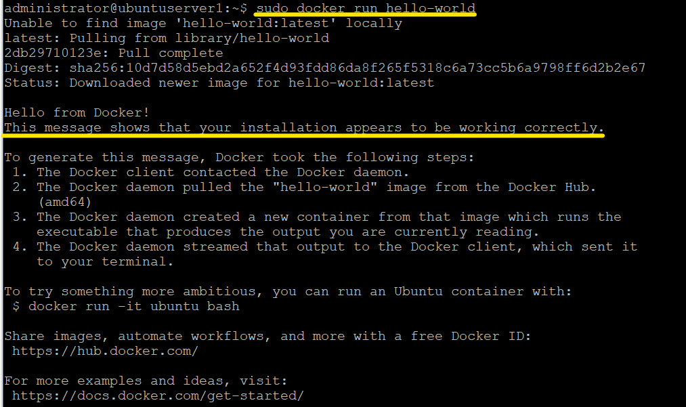

# 🐋 Docker, установка и настройка

## Порядок установки 
### Простой
Установить Docker из поставки Ubuntu. Раньше там был очень старый релиз, но эти времена прошли. Теперь Docker устанавливается одной строкой:
```
sudo apt install docker.io
```

### Сложный
Docker предлагает воспользоваться [инструкцией](https://docs.docker.com/engine/install/ubuntu/) по установке, в частности используя репозитории или скрипты.

## Проверка установки
Проверяем успешность установки Docker.
```
sudo docker run hello-world
```

