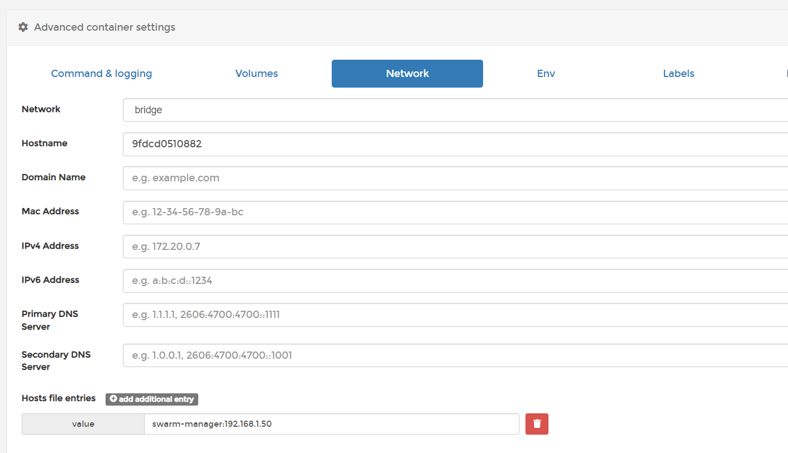

# Extra hosts, для подключения Jenkins

В интерфейсе Portainer можно удобно настроить `extra_hosts`, для подключения Jenkins.

Для этого выбираем контейнер Jenkins, и нажимаем кнопку Duplicate/Edit.

В открывшемся окне спускаемся в раздел Advanced container settings и переключаемся на Network.

Внизу добавляем строку соответствия адреса из сертификата и IP.

```
swarm-manager:192.168.1.50
```
