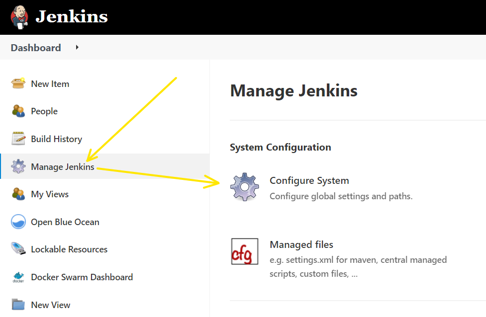

# Jenkins-lib

Плагин для Jenkins, упрощающий конфигурацию пайплайна для 1С.

## Подключение 

Подключение настроенного пайплайна для проверки конфигураций 1С.

**Manage Jenkins** - **Configure System**.



Ищем раздел **Global Pipeline Libraries** и нажимаем **Add**.

Заполняем

| Поле | Значение | Комментарий |
|-|-|-|
| Name | jenkins-lib | |
| Default version | v0.5.0 | Тэг, или ветка master |
| Load implicitly | Истина | Чтобы эта библиотека всегда загружалась по умолчанию |
| Retrieval method | Modern SCM | |
| Source Code Management | Git | |
| Project Repository | https://github.com/kropachev/jenkins-lib.git | Адрес к репозиторию, можете сделать свою ветку |

Сохраняем.

## Настройка 

В каталоге с репозиторием проекта (в который **GitSync** выгрузил файлы исходники конфигурации 1С) необходимо создать несколько файлов.

`jobConfiguration.json`, конфигурационный файл:

```json
{
    "$schema": "https://raw.githubusercontent.com/firstBitSemenovskaya/jenkins-lib/master/resources/schema.json",
    "v8version": "8.3.19.1522",
    "stages": {
        
    }

}
```
**v8version**, это версия платформы.

`Jenkinsfile`, описание пайплайна для 1С.

```
pipeline1C()
```


Пушим файлы в гит.

Переходим в интерфейс Jenkins.

**Dashboard** - **New Item**

Заполняем **item name**, например `demodb_pipeline`.

Выбираем **Multibranch Pipeline**.

Жмем **OK**.

Открывается окно нашего пайплайна, заполняем.

**Branch Sources** - **Git**, Выбираем из выпадающего списка кнопки **Add Source**.

Project Repository - `http://192.168.10.50:11080/devteam/demodb.git`, Путь к репозиторию в GitLab.

**Credentials**, выбираем **Jenkins**.

В открывшемся окне добавляем имя и пароль от git (`root`). **Description** - **root gitlab password**.

Жмем **Add**, выбираем в списке только что созданные параметры.

Проверяем **Build configuration**. **Mode** должно быть **by Jenkinsfile**, а **Script Path** - **Jenkinsfile**, как файл в репозитории.

**Scan Multibranch Pipeline Triggers** - Ставим галку в пункте **Periodically if not otherwise run**. Интервал 60 минут, например.

Жмем **Save**.

Для шага подготовки требуется агент с меткой **agent**, Добавляем.

**Manage Jenkins** - **Manage nodes and clouds**.

**Configure Clouds**.

Листаем вниз, жмем **Docker Agent templates**.

Находим агент с номером платформы и в поле **Labels** дописываем слово **agent** (Получится **8.3.21.1302 agent**, например. Зависит от версии платформы).

После этого можно запустить сборку первый раз, для проверки.

Если пайплайн зеленый, то начинаем добавлять тесты.

Добавим в проверку SonarQube.

Редактируем файл `jobConfiguration.json`, добавляем строку sonarqube.

```json
{
    "$schema": "https://raw.githubusercontent.com/firstBitSemenovskaya/jenkins-lib/master/resources/schema.json",
    "v8version": "8.3.21.1302",
    "stages": {
        "sonarqube": true
    }

}
```

В этом же каталоге создаем файл `sonar-project.properties`.

**sonar.projectKey**, ключ проекта

**sonar.projectName**=название проекта

**sonar.sources**=путь к исходникам

**sonar.sourceEncoding**=кодировка исходников

**sonar.inclusions**=маска анализируемых файлов

```
sonar.projectKey=democonf
sonar.projectName=DemoConf

sonar.sources=src/cf

sonar.sourceEncoding=UTF 8

sonar.inclusions=**/*.bsl
```