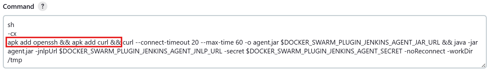

# Агент Sonarqube для Jenkins

К этому моменту контейнер SonarQube должен быть уже установлен.

**Dashboard** - **Manage Jenkins** - **Clouds** - **Docker Swarm**.

**Configure** 

Скролим вниз, до кнопки **Docker Agent templates**. Нажимаем и далее жмем **Add Docker Agent Template**

**Labels**: `sonar`

**Image**: `sonarsource/sonar-scanner-cli:latest` 

**Command**: перед curl добавляем `apk add openssh && apk add curl &&`

**Working Directory**: `/home/jenkins`

**User**: `root`

При анализе больших проектов может появляться ошибка `java.lang.OutOfMemoryError`, нехватает памяти. Для увеличения выделяемой для анализа памяти добавим настройки окружения.
Здесь `6g` означает означает 6 гигибайт оперативной памяти. Обычно этого хватает для анализа ERP. 

**Env (newline-separated)**: `SONAR_SCANNER_OPTS=-Xmx6g`

Жмем **Save**.