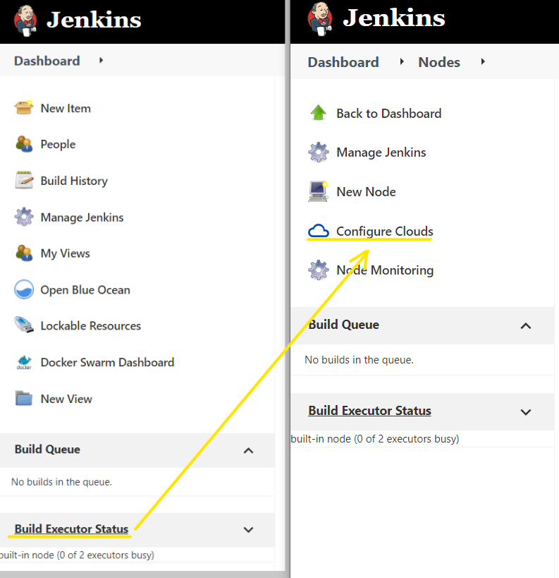
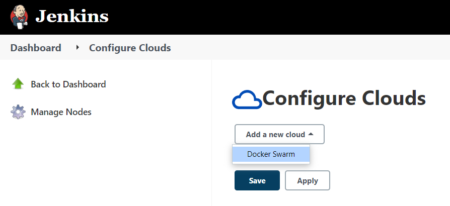
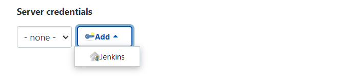

# Подключение Docker Swarm

В панели Jenkins необходимо перейти **Build Executor Status** - **Configure Clouds**.



При добавлении новой конфигурации будет доступен новый провайдер - **Docker Swarm**. Выбираем его.


В открывшемся окне настройку следует начать с указания параметров авторизации



А сертификация будет проходить по сертификатам, которые добавляли при настройке Docker.

Тип сертификата указываем **X.509 Client Certificate** и копируем в поля наши сертификаты.


Напомню, сертификаты хранятся в папке **/var/lib/docker/swarm/certificates/** (для доступа к папке понадобятся права **root**).

Соответствие имен файлов полям на форме

| | | |
|-|-|-|
| swarm-node.key | Client Key | ```sudo nano /var/lib/docker/swarm/certificates/swarm-node.key``` |
| swarm-node.crt | Client Certificate | ```sudo nano /var/lib/docker/swarm/certificates/swarm-node.crt``` |
| swarm-root-ca.crt | Server CA Certificate | ```sudo nano /var/lib/docker/swarm/certificates/swarm-root-ca.crt``` |

**ID**: swarm-creds

**Description**: swarm creds

Жмем **Add**.

Теперь выбираем созданные **swarm-creds** в **Server credentials**.

В поле **Docker Host URI** указываем https://swarm-manager:2376. **2376**, потому что всегда такой порт. А вот **swarm-manager**, потому что такой путь указан в сертификате. А настройку соответствия нашего IP этому адресу мы уже делали в настройках **Extra hosts* в Docker.

В поле **Jenkins Url** указываем адрес, по которому мы подключаемся - http://192.168.10.50:8080/, например.

Жмем кнопку **Test connection**, результатом будет **Connection successful**. Возможно потребуется записать и потом снова зайти в эту настройку и проверить соединение, если с первого раза тест неуспешный.