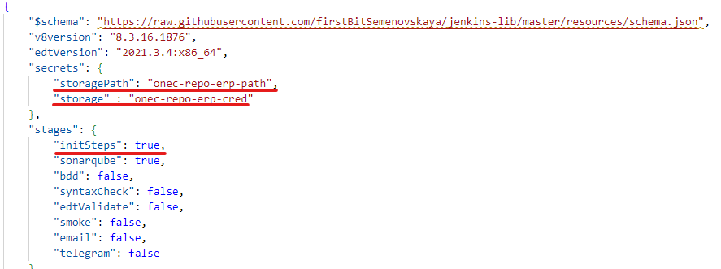
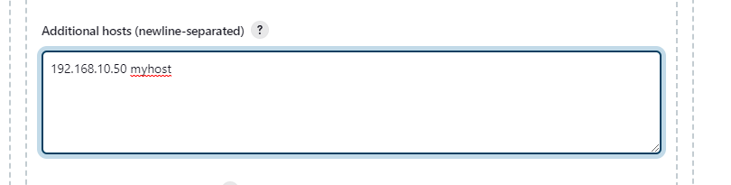
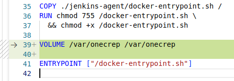

# Подключение к хранилищу

Подключение к хранилищу используется в том случае, если разработка ведется с использованием хранилища. 🤷🏻‍♂️

Для подключения к хранилищу понадобиться добавить Секреты с адресом хранилища и параметрами авторизации в хранилище.

Добавляем.

**Manage Jenkins** - **Manage Credentials**.

В разделе **Stores scoped to Jenkins** жмем на **Jenkins**, а затем **Global credentials (unrestricted)**.

Открывается окно **Global credentials (unrestricted)**.

В левой части жмем на кнопку **Add Credentials**.

Добавляем путь к хранилищу.

**Kind** - Secret text.

**Secret** - Путь к хранилищу.

**ID** - Название секрета.

**Description** - Описание.

Добавляем параметры авторизации в хранилище.

**Kind** - Username with password.

**Username** - Логин.

**Password** - Пароль.

**ID** - Название секрета.

**Description** - Описание.

 

Теперь в конфигурационном файле `jobConfiguration.json` для Jenkins необходимо указать эти данные. В этом же файле указываем `"initSteps": true`.



Включив этап `initSteps` может появиться ошибка **Temporary failure in name resolution**. Для этого можно указать соответствие имени и ip, аналогично hosts.  этого идем в **Manage Jenkins** - **Manage nodes and clouds** - **Configure Clouds**, спускаемся вниз и жмем **Docker Agent templates...**. В открывшемся списке найти **Additional hosts (newline-separated)**, в этом поле внести соответствия.



Если хранилище расположено в сетевой папке и не опубликовано на сервере хранилищ (скорее всего так), то придется сначала смонтировать сетевую папку на сервер с докером, а потом пробросить volume к этой папке.

Ну и контейнеры с агентом 1с придется пересоздать.

Монтируем
```
sudo mount -t cifs -o username=sergey,password=123,domain=yourdomain,uid=1000,iocharset=utf8,file_mode=0777,dir_mode=0777 //192.168.10.50/1crepository /var/onecrep
```

Создаем volume в контейнере с клиентом

Идем в папку с проектом `onec-docker`, затем `jankins-agent`.

В файле `Dockerfile` добавляем строку

```dockerfile
VOLUME /var/onecrep /var/onecrep
```


Запускаем скрипт создания контейнеров (см. соответствующий раздел).

Теперь в дженкинсе ассоциируем volume контейнера с путем на сервере.

В интерфейсе Jenkins:

**Manage Jenkins** - **Manage nodes and clouds** - **Configure Clouds**.

Жмем Docker Agent templates и в шаблоне с платфрмой (номер платформы в labels) ищем раздел 

**Host Binds (newline-separated)**. Добавляем строку

```
/var/onecreperp:/var/onecrep/erp
```

Почти готово.

Если лицензии 1С раздает сервер, то придется использовать серверную базу.

Создаем на сервере пустую базу 1с и добавляем еще один секрет **tempBasePath**.


Секрет с типом строка. Формат следующий:

```
/SMYServerh:1541/MyBase
```

`SMYServerh` - Имя сервера

`1541` - Порт

`MyBase` - Имя базы на сервере

Готово.

 