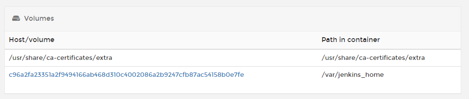

# Сертификаты для Jenkins

Решение ощибки `javax.net.ssl.SSLPeerUnverifiedException: peer not authenticated`.

Необходимо пробросить папку с сертификатами хоста в контейнер с Jenkins. Для этого монтируем том с путем `/usr/share/ca-certificates/extra`.  На хосте к этому моменту уже должен быть установлен сертификат.



Ошибка установки соединения появляется из-за **javasdk**, ему и нужно добавить наш сертификат.

Запускаем консоль в контейнере и выполняем команду

```
keytool -importcert -file /usr/share/ca-certificates/extra/MyRootCA.crt -cacerts -keypass changeit -storepass changeit -noprompt -alias MyRootCA
```

`/usr/share/ca-certificates/extra/MyRootCA.crt` - полный путь к сертификату.

`MyRootCA` - алиас.

Перезапускам контейнер.

Возможна так же ошибка доступа к github. Для этого в консоли контейнера выполняем команду

```
dpkg-reconfigure ca-certificates
```

Указываем номер сертификата, который пробросили ранее (скорее всего 1).

