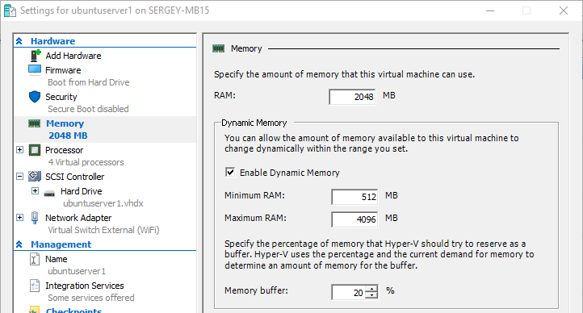

# Виртуальная машина, создание

Если у Вас есть опыт создания виртуальных машин или возможность попросить создать виртуалку у системного администратора, то этот раздел можно пропустить. Никаких особенностей для простых пользователей здесь не будет.

Для виртуализации будет использоваться hyper-v, это бесплатно и уже встроено в windows.

## Включение Hyper-V
Подробная инструкция доступна на сайте Microsoft [(Включение Hyper-V в Windows 10 | Microsoft Learn)](https://learn.microsoft.com/ru-ru/virtualization/hyper-v-on-windows/quick-start/enable-hyper-v#enable-the-hyper-v-role-through-settings)

Жмем правой кнопкой мыши на **Пуск**, выбираем верхний пункт, **Apps and Features**.

В правой части, в разделе **Related settings**, нажимаем на ссылке **Programs and features**.

В открывшемся окне, в левой части жмем на ссылку **Turn Windows features on or off**.

Откроется окно с доступными компонентами. Ищем **Hyper-V** и ставим галочку. Перезагружаемся.

Если галка уже стоит, то сразу запускаем Hyper-V Manager.

Нажимаем пуск и вводим hyper-v и выбираем приложение Hyper-V Manager.

Hyper-V Manager состоит из четырех окон

1. Дерево консоли (список хостов).
1. Список виртуальных машин.
1. Детали выбранной виртуальной машины.
1. Возможные действия.

## Подготовка

Если это первое создание виртуальной машины, то потребуется немного подготовиться.

Начнем с создания виртуального сетевого коммутатора, чтобы наша виртуальная машина имела сетевой интерфейс и доступ интернету.

В дереве консоли выбираем свою машину, а в окне действий **Virtual Switch Manager...**

Откроется окно Virtual Switch Manager. Слева выбираем **New virtual network switch**, а справа выбираем **External** (значит будет доступ к внешней сети) и жмем кнопку **Create Virtual Switch**.

Далее все просто:

**Name**: произвольное имя, например Virtual Switch External (WiFi), т.е. чтобы нам самим было понятно, это виртуальный коммутатор, внешний, использует WiFi хоста.

В разделе **Connection type** ставим переключатель в поле External network и выбираем сетевой адаптер, который подключен к сети.

Жмем Ok. Готово.

## Создание

В дереве консоли выбираем свою машину, а в действиях **New** - **Virtual Machine...**

Откроется New Virtual Machine Wizard.

Закладка **Specify Name and Location**.

**Name** - Имя виртуальной машины, например ubuntuserver1

**Store the virtual machine in a different location** - Советую поставить галку и указать путь, где будет храниться виртуальная машина.

Далее.

Закладка **Specify Generation**.

Выбирайте **Generation 2**.

Далее.

Закладка **Assign Memory**.

Памяти надо будет много. Зависит от объема доступной памяти на хосте. Лучше посмотреть в доступный объем в диспетчере и дать половину.

Ну и поставить галку **Use Dynamic Memory for this virtual machine**.

Далее.

Закладка **Configure Networking**.

Выбираем созданный ранее виртуальный коммутатор.

Далее

Закладка **Virtual Hard Disk**.

Подключать существующий жесткий диск нам пока рано, так что создаем новый.

Переключатель в **Create a virtual hard disk**.

**Name** - по умолчанию будет имя виртуальной машины, оставляем.

**Location** - тоже заполнено по умолчанию, папка выбранная ранее и имя виртуальной машины. Оставляем.

**Size** - Опять же, сколько не жалко. Смотрите, сколько доступно, исходя из этого выбирайте размер. Потом можно будет изменить, но не так просто.

Далее.

Закладка **Installation Options**.

Сразу запускать процесс установки операционной системы не будем, нужно еще кое-что настроить, поэтому ставим галку **Install an operating system later**.

Далее

Закладка **Summary**.

Любуемся выбранными значениями и нажимаем Финиш.

Виртуальная машина создана но требуются дополнительные настройки.

## Дополнительные настройки

Правой кнопкой кликаем по нашей виртуальной машине и выбираем **Settings**.

Раздел **Security**.

Убираем галку **Enable Security Boot**.

Раздел **Memory**.

В поле **Maximum RAM** ставим максимальный объем памяти, который мы готовы выделить виртуальной машине. По умолчанию в этом поле стоит очень больше число, если не ограничить, то виртулка съест всю память и все сломается.

Раздел **Processor**.

А вот процессорных мощностей можно добавить. По умолчанию доступен 1 логический процессор. Давайте дадим половину от всех мощностей. Ориентируйтесь на поле **Percent of total system resources**.

Жмем **Apply** для сохранения настроек..

Раздел **SCSI Controller**.

Финальный штрих. Нужно выбрать образ операционной системы, которая будет установлена при первом запуске.

Выбираем *DVD Drive*, жмем Add.

Появился подраздел **DVD Drive None**. 

В разделе **Media** ставим переключатель **Image file** и выбираем файл с образом системы, который мы заблаговременно скачали.

Теперь жмем **Ok**.

 

Виртуальная машина готова к первому запуску и установке выбранной операционной системы.