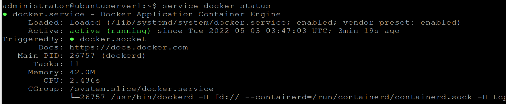

# Включение Docker Swarm

Облегчит работу в Jenkins.

Создание docker swarm.
```
docker swarm init
```

Если несколько сетевых интерфейсов:
```
docker swarm init --advertise-addr 192.168.10.50
```


В ответе мы получаем информацию о том что нода теперь является менеджером кластера, команду для подключения к кластеру и команду для подключения нового менеджера к кластеру.

Указываем необходимость использования сертификата при взаимодействии с докером. Для этого редактируем файл конфигурации docker daemon. 
Узнать имя конфигурационного файла можно выполнив команду.
```
service docker status
```


```
sudo nano /lib/systemd/system/docker.service
```

Сертификаты находятся в папке /var/lib/docker/swarm/certificates/
Ищем строку запуска демона ExecStart и добавляем команды.

```
-H tcp://0.0.0.0:2376 \
--tlsverify \
--tlscacert=/var/lib/docker/swarm/certificates/swarm-root-ca.crt \
--tlscert=/var/lib/docker/swarm/certificates/swarm-node.crt \
--tlskey=/var/lib/docker/swarm/certificates/swarm-node.key
```

В данном случае указан порт для взаимодействия `2376`, указан флаг для защиты tlsverify и адреса сертификатов и ключа.

Перезапускаем

```
systemctl daemon-reload
```
```
service docker restart
```

Проверяем

```
service docker status
```
