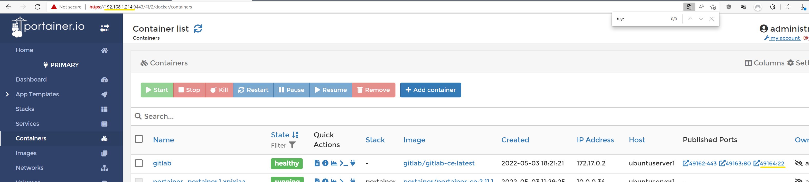
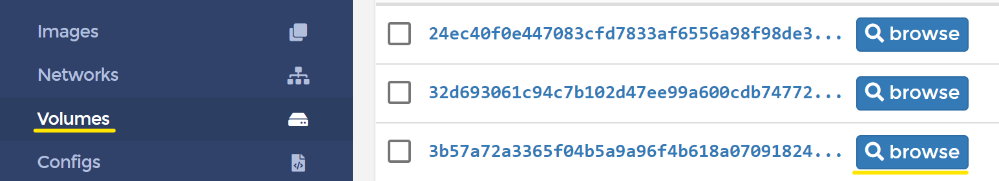

# 🦊 Gitlab, установка и настройка

### Полезные ссылки:

[Provision gitlab-ce on docker with Portainer - GeralexGR](https://blog.geralexgr.com/cloud/provision-gitlab-ce-on-docker-with-portainer)

[GitLab Docker images | GitLab](https://docs.gitlab.com/ee/install/docker.html)

Перед установкой настоятельно рекомендую проверить доступность оперативной памяти. Если при установке виртуалки выделили по остаточному принципу, то самое время увеличить своп - [Ubuntu - Увелиение swap](ubuntu-увелиение-swap).

Установка Gitlab возможна из шаблонов Portainer или из командной строки, если доступ к ресурсу с шаблонами недоступен.

## 1. Установка из шаблона Portainer

Пока самый простой способ.

Открыть страницу Portainer. Переключиться в раздел App Templates.

В поиске набрать gitlab и включить переключатель Отображать шаблоны контейнеров.


Выбрать найденный контейнер, указать наименование (gitlab) и запустить развертывание.

После развертывания и запуска сервиса подключиться к нему можно по адресу сервера и порта, указанного для контейнера.


Для подключения потребуется пароль от пользователя `root`. Этот пароль указан в файле `initial_root_password`, который находится в каталоге `/etc/gitlab`.

Просмотреть файл можно в разделе Volumes


Выбрав нужный том, можем скачать и просмотреть файл.


## 2. Установка без шаблона

Возможна установка без шаблона, если они блокируются фаерволлом, например.

Команда для установки.

```powershell
sudo docker run --detach   --hostname gitlab   --publish 10443:443 --publish 1080:80 --publish 1022:22   --name gitlab   --restart always   --volume $GITLAB_HOME/config:/etc/gitlab   --volume $GITLAB_HOME/logs:/var/log/gitlab   --volume $GITLAB_HOME/data:/var/opt/gitlab   --shm-size 256m   gitlab/gitlab-ce:latest
 ```

