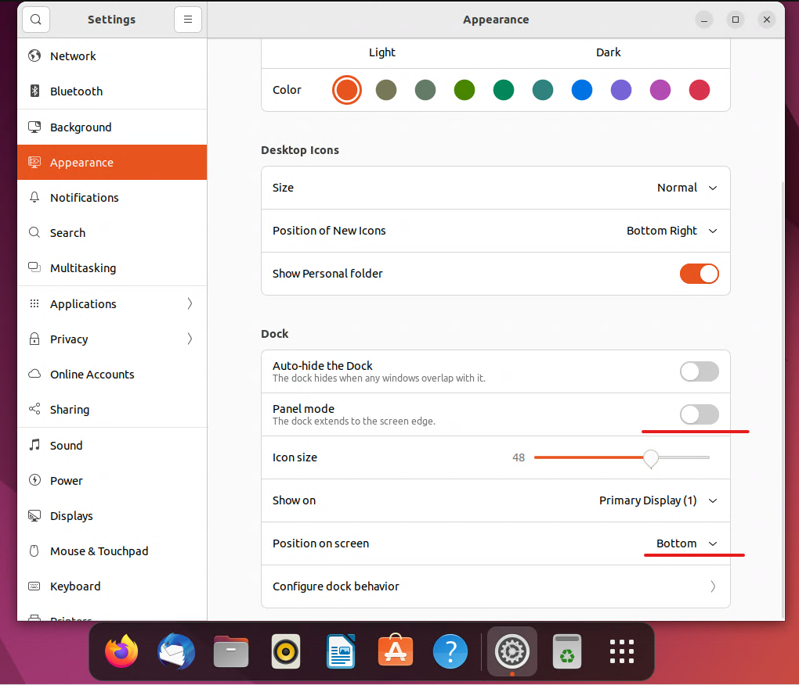

# Ubuntu, настрока красоты

Кликаем прапвой кнопкой по рабочуму столу, выбираем Desktop Icons Settings. Оказываемся в окне настроек, разделе Appearence.

Panel mode - отклучаем

position on screen - bottom

Получится вот так. Почти как в Windows 11. 

