# 🐧 Виртуальная машина Ubuntu, создание и установка.

Если у Вас есть опыт создания виртуальных машин или возможность попросить создать виртуалку у системного администратора, то этот раздел можно пропустить. Никаких особенностей для простых пользователей здесь не будет.

Для виртуализации будет использоваться hyper-v, это бесплатно и уже встроено в windows.

## Включение Hyper-V
Подробная инструкция доступна на сайте Microsoft [(Включение Hyper-V в Windows 10 | Microsoft Learn)](https://learn.microsoft.com/ru-ru/virtualization/hyper-v-on-windows/quick-start/enable-hyper-v#enable-the-hyper-v-role-through-settings)

Жмем правой кнопкой мыши на **Пуск**, выбираем верхний пункт, **Apps and Features**.

В правой части, в разделе **Related settings**, нажимаем на ссылке **Programs and features**.

В открывшемся окне, в левой части жмем на ссылку **Turn Windows features on or off**.

Откроется окно с доступными компонентами. Ищем **Hyper-V** и ставим галочку. Перезагружаемся.

Если галка уже стоит, то сразу запускаем Hyper-V Manager.

Нажимаем пуск и вводим hyper-v и выбираем приложение Hyper-V Manager.

Hyper-V Manager состоит из четырех окон

1. Дерево консоли (список хостов).
1. Список виртуальных машин.
1. Детали выбранной виртуальной машины.
1. Возможные действия.

## Подготовка

Если это первое создание виртуальной машины, то потребуется немного подготовиться.

Начнем с создания виртуального сетевого коммутатора, чтобы наша виртуальная машина имела сетевой интерфейс и доступ интернету.

В дереве консоли выбираем свою машину, а в окне действий **Virtual Switch Manager...**

Откроется окно Virtual Switch Manager. Слева выбираем **New virtual network switch**, а справа выбираем **External** (значит будет доступ к внешней сети) и жмем кнопку **Create Virtual Switch**.

Далее все просто:

**Name**: произвольное имя, например Virtual Switch External (WiFi), т.е. чтобы нам самим было понятно, это виртуальный коммутатор, внешний, использует WiFi хоста.

В разделе **Connection type** ставим переключатель в поле External network и выбираем сетевой адаптер, который подключен к сети.

Жмем Ok. Готово.

## Создание

В дереве консоли выбираем свою машину, а в действиях **Quick Create...**

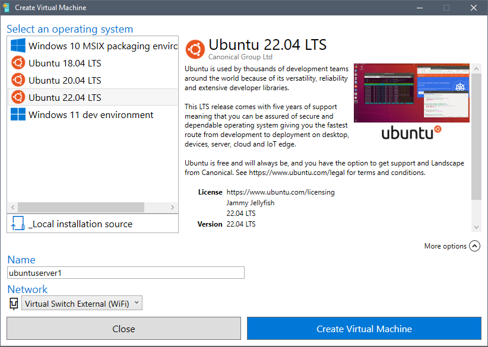

В открывшемся окне выбираем актуальную версию **Ubuntu - 22.04 LTS.**

Внизу-справа нажимаем **More options** и заполняем открывшиеся поля.

**Name** - Имя виртуальной машины, например ubuntuserver1.

**Network** - Выбираем созданный ранее виртуальный коммутатор.

Нажимаем **Create Virtual Machine** и ждем. Скачается установочный образ и запустится процесс установки.

Когда почти все будет готово, на экран появится приглашение подключиться к созданной виртуальной машине, или редактировать настройки.
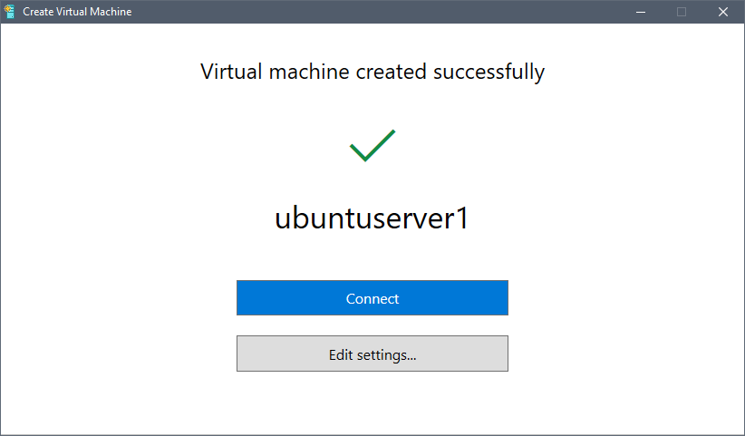

Начнем с настроек. Жмем **Edit settings**

Раздел **Memory**.

В поле **Maximum RAM** ставим максимальный объем памяти, который мы готовы выделить виртуальной машине. По умолчанию в этом поле стоит очень больше число, если не ограничить, то виртулка съест всю память и все сломается.

Раздел **Processor**.

Давайте дадим половину от всех мощностей. Ориентируйтесь на поле **Percent of total system resources**.

Мастер быстрого создания виртуальной машины создает жесткий диск небольшого размера, всего 12 гигабайт. Сейчас можно было бы его расширить, но настроек самого жесткого диска будет недостаточно. Поэтому увеличение жесткого диска и последующие настройки в Ubuntu будут рассмотрены в отдельном разделе.

Раздел **Checkpoints**.

Отключаем создание чекпоинтов, иначе нельзя будет изменить размер жесткого диска.

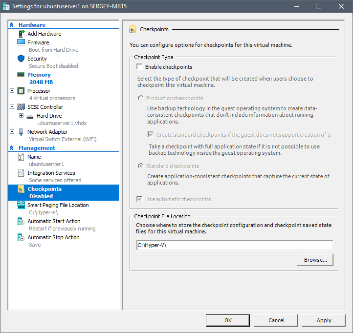

Подтверждаем изменения - **OK**.

Теперь можно подключаться, нажимаем большую синюю кнопку **Connect**, а в открывшемся окне виртуальной машины **Start**.

Виртуальная машина запущена и начат процесс установки операционной системы.

## Установка

Процесс установки начинается с экрана выбора языка. Выбираем **English**.
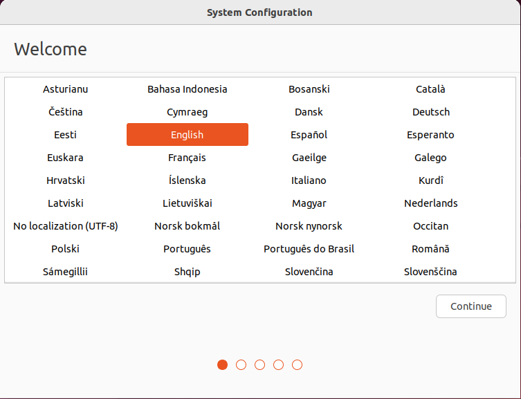

Раскладка клавиатуры, тут уже по ситуации. Скорее всего **Russian**.

Часовой пояс - Выбираете свой.
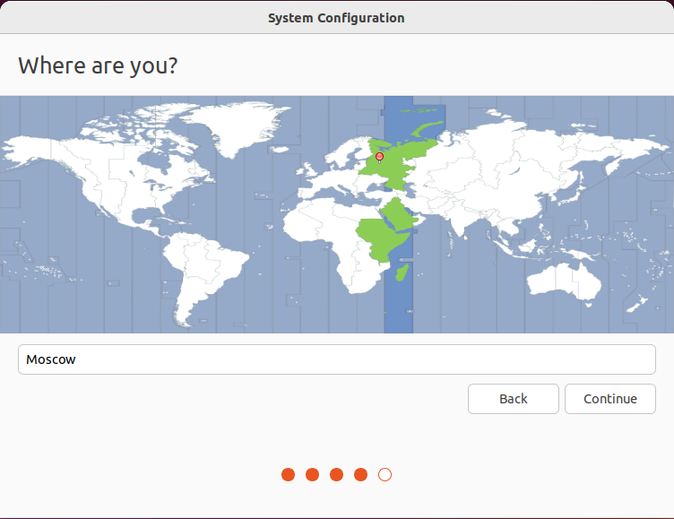

Создаем пользователя, придумываем имя нашего сервера и пароль.

Остальные галки оставляем без изменения.
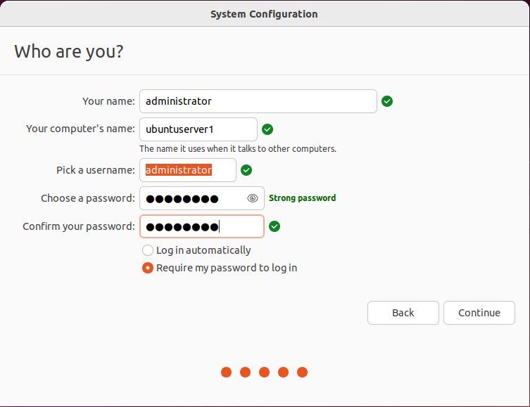

В процессе установки появится окно с предложением выбрать разрешение экрана для подключения к виртуальной машине. Указываем комфортное для себя разрешение и жмем **Connect**.

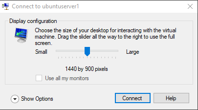

Откроется окно подключения, вводим имя пользователя и пароль.

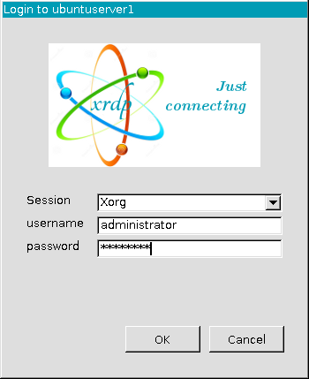

Онлайн аккаунт, пропускаем.

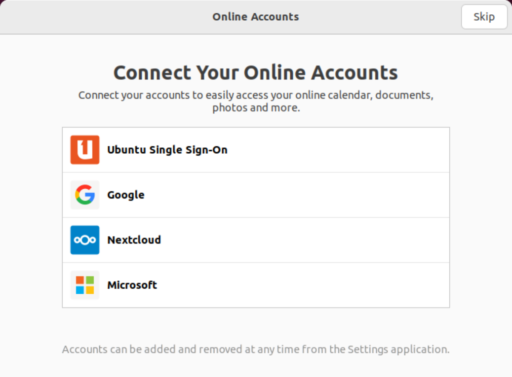

Livepatch - Жмем Next.

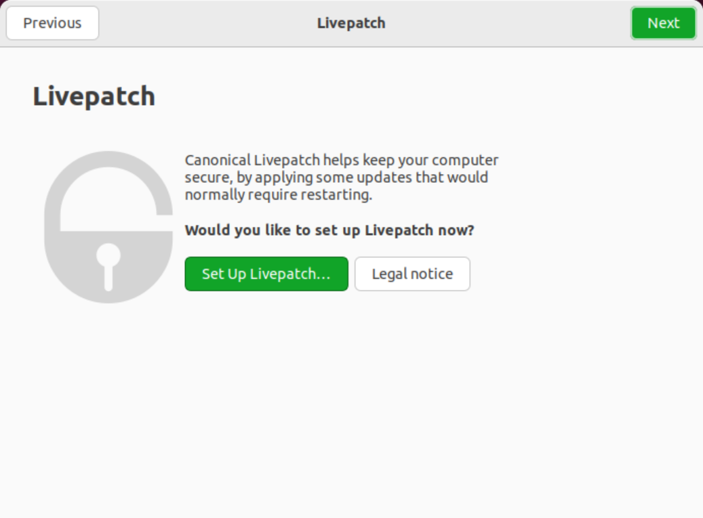

Help improve Ubuntu - Сами решаете, отправлять ли данные об использовании в Canonical.

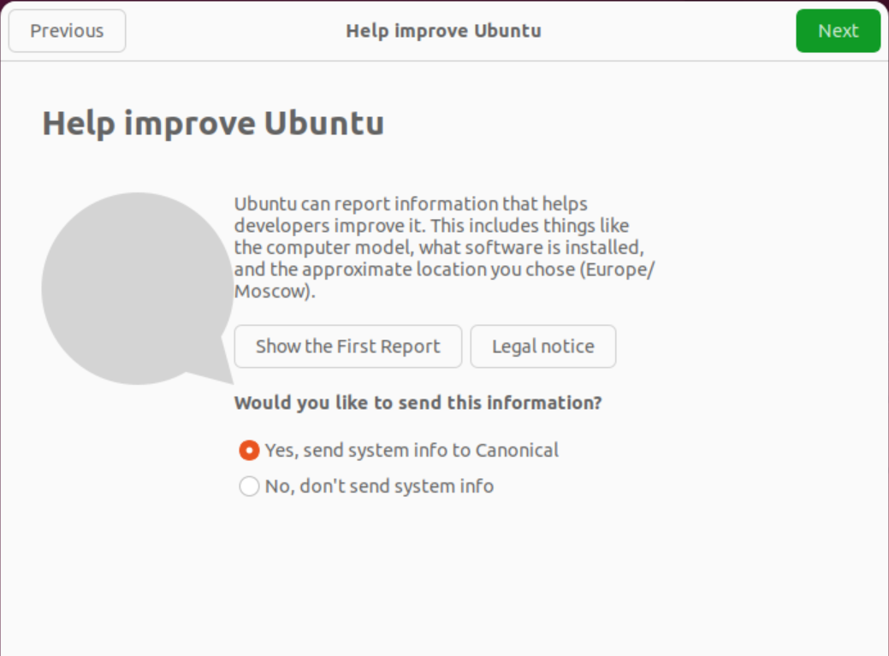

Privacy - Тоже решаете сами, разрешить ли определять географическую локацию.

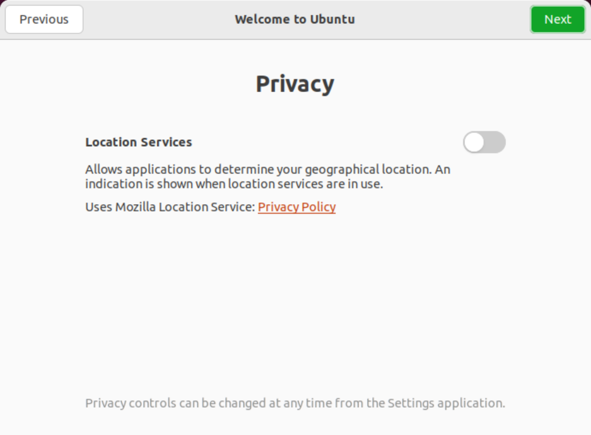

Наконец, готово. Пока не будем выбирать приложения для установки. Жмем **Done**.

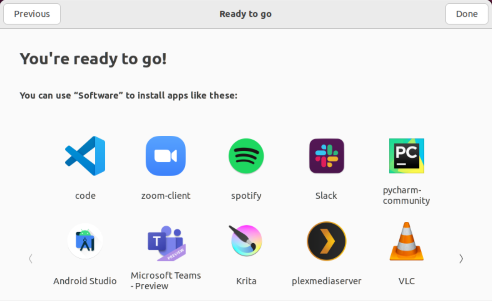

**Настройки сети**.

Сразу поменяем IP на статичный, для последующего удобного подключения. В верхнем правом углу нажимаем на панель с иконками и выбираем **Settings**.

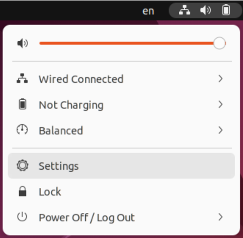

Раздел **Network**. В поле с активным соединением жмем на кнопку настроек (шестеренка).

Переходим в закладку *IPv4*.

Устанавливаем переключатель в **Manual**.

**Adress** - IP адрес, любой доступный.

**Netmask** - Сетевая маска, скорее всего 255.255.255.0.

**Gateway** - IP адрес роутера.

**DNS** - IP адрес роутера, или dns сервеа, или 8.8.8.8 (google).

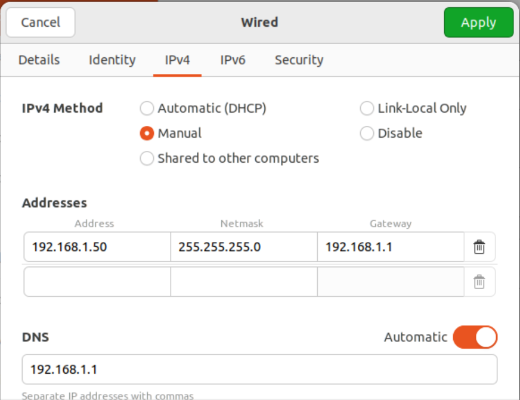
 

Переходим в закладку **IPv6**.

Устанавливаем переключатель в **Disabled**.

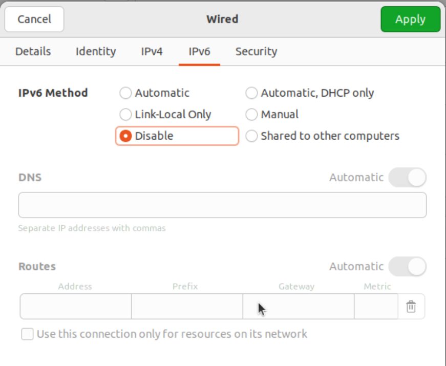

Жмем **Apply**.

Возможно потребуется выключить и вновь включить сетевое соединение, чтобы сетевые настройки были применены.

Готово.